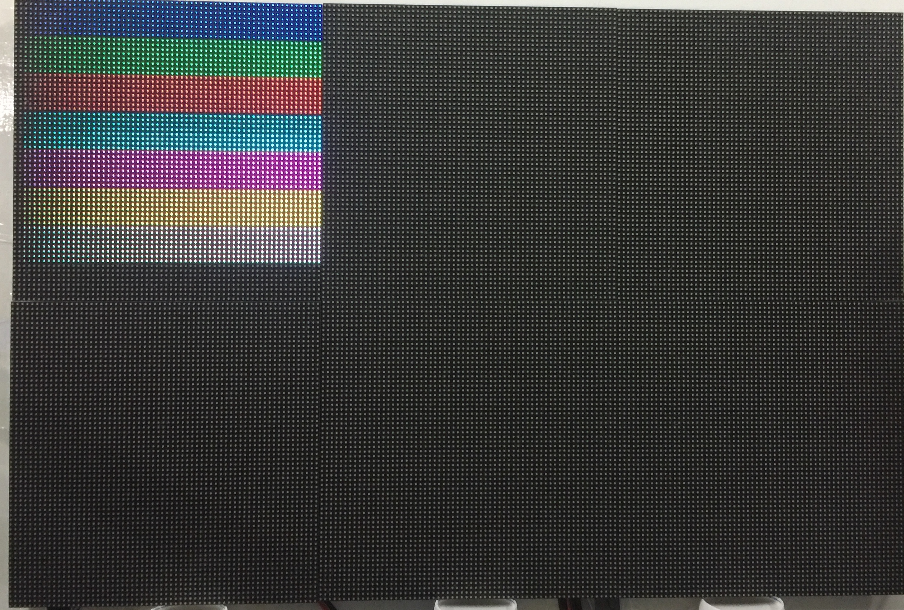
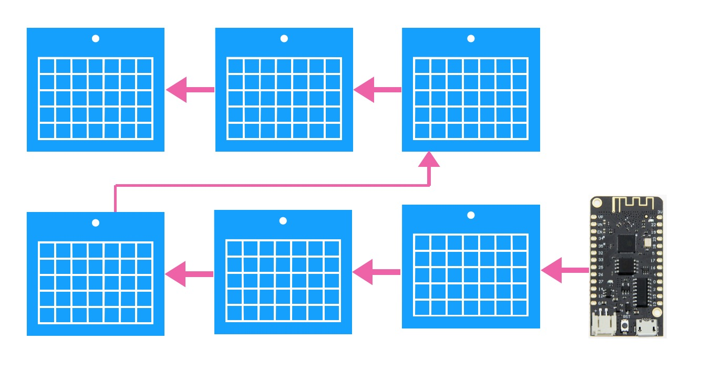
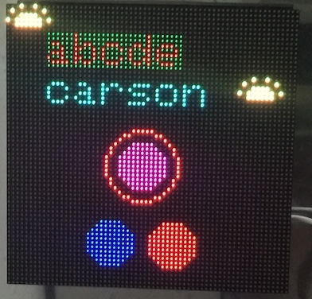
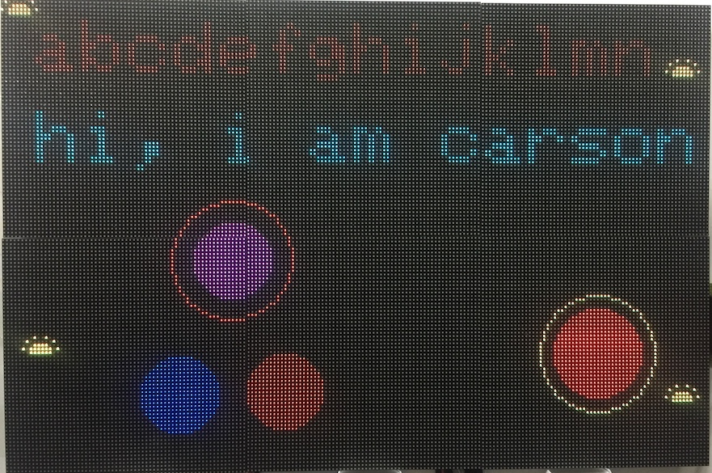
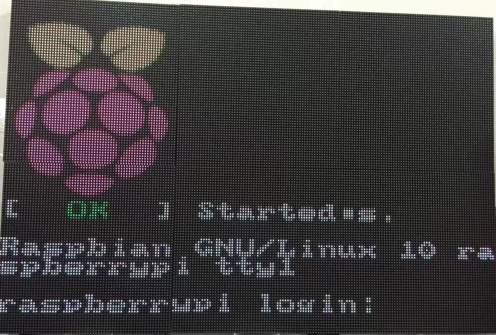
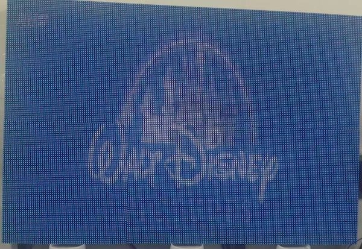
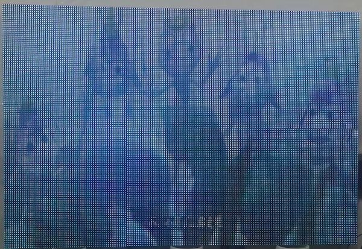

# RGBMatrixPanel library for the ESP32, utilising I2S DMA

得到[mrfaptastic](https://github.com/mrfaptastic/ESP32-RGB64x32MatrixPanel-I2S-DMA)启发, fork并扩展了功能：

* 修改了IO映射，留出SPI接口可以扩展连接树莓派
* 关掉了双buffer功能，留存更多的RAM来扩展更大的显示屏：192x128
* 受SPI接口速度限制，外部SPI显示传输刷新率只有20HZ
* RAM限制和DMA输出频率限制，RGB Panel刷新率只有70HZ，会有一点闪烁感
* can theoretically provide 5 bit colour: RGB555

## Usage

* 如果不需要那么高的亮度，可以将亮度调低减小电流:
`matrix.setPanelBrightness(8);`
* 注意有的面板LED接口顺序是RGB，有的则是BGR，还有RBG，有时需要调整IO，可以在直接matrix.begin()函数重新分配IO
`matrix.begin(R1,G1,B1,R2,G2,B2.....)`
* 暂时没测试FM612X系列驱动IC的面板，这类IC比较特殊，需要定义锁存脉冲个数
* 开发环境PlatformIO
* 如果连接6个面板，我是这样排列的

* 测试64x64的效果[examples/test_64x64/test_64x64.cpp]

`#define mw 64`

`#define mh 64`

* 测试192x128的效果[examples/test_192x128/test_192x128.cpp]

`#define mw 192`

`#define mh 128`

## Circuit & PCB

By default the pin mapping is as follows (defaults defined in ESP32-RGBMatrixPanel-I2S-DMA.h).

请注意线路是按单个面板画的（64x64），如果拼接多个面板，电源需要加强加强再加强。即单独外加5V/3A以上电源。

## 连接树莓派或其它

通过SPI接口连接到树莓派，RGBMatrixPanel模拟成一块SPI TFT显示屏。

......待续

## Credits

* ['ESP32-RGB64x32MatrixPanel-I2S-DMA' library](https://github.com/mrfaptastic/ESP32-RGB64x32MatrixPanel-I2S-DMA)
* ['SmartMatrix' project code](https://github.com/pixelmatix/SmartMatrix/tree/teensylc)
* [Sprite_TM's demo implementation here](https://www.esp32.com/viewtopic.php?f=17&t=3188)
